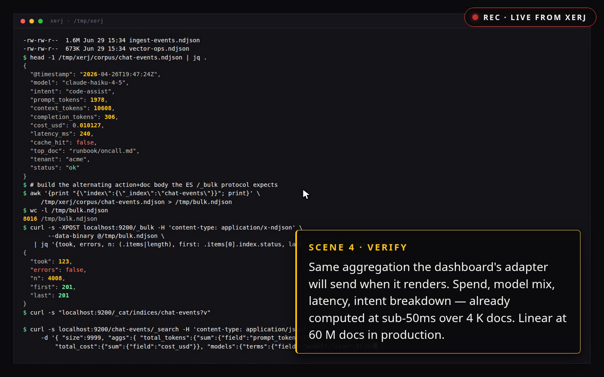

# XERJ

XERJ is a search engine for AI agents. Point it at a folder and one command makes
your code, docs, logs and PDFs queryable, so an agent asks questions instead of
reading files into its context window.

It speaks the Elasticsearch API, so existing clients, dashboards and tooling work
against it unchanged.

[](https://github.com/xerj-org/xerj/actions/workflows/ci.yml)
[](./LICENSE)
[](https://github.com/xerj-org/xerj/releases)
[](https://xerj.org/benchmarks)

<video src="https://xerj.org/xerj-biz-demo.mp4" poster="docs/media/demo-poster.png" controls muted playsinline width="840">
  <a href="https://xerj.org/aise-demo.html"></a>
</video>

<sub>Boot, bulk ingest, search, vector kNN, live dashboards, no cuts.
<a href="https://xerj.org/aise-demo.html">Watch it on xerj.org</a> or
<a href="https://xerj.org/playground/">try the live playground</a>.</sub>

## Install

```sh
curl -fsSL https://xerj.org/get | sh
```

Windows PowerShell:

```powershell
irm https://xerj.org/get.ps1 | iex
```

One static binary, no JVM, no dependencies. Prebuilt for Linux, macOS and Windows
on x86-64 and arm64. You can also [build from source](#build-from-source).

## Index a folder

Start the server, then point `autoindex` at anything:

```sh
xerj --insecure --data-dir ./data &     # local dev: no TLS, no auth
xerj autoindex ~/my-project
```

That is the whole setup. There is no schema to write and no pipeline to
configure. XERJ sniffs each file, works out what it is, and creates one index per
dataset it finds:

```
phase A: 593 datasets inferred, 1955 junk/skipped files
phase B: indexing 25329 files with 8 workers
done in 158.1s, 593 datasets, 83103 records live, 790 junk records
```

Source files go through tree-sitter, so code arrives with its symbols and line
numbers instead of as flat text. CSV, JSON, JSONL, XML, YAML, SQLite, PDF, DOCX,
HTML and common log formats are all handled.

## Search it

This is the Elasticsearch API, so you already know this part:

```sh
# what did it find?
curl localhost:9200/_cat/indices

# full-text
curl "localhost:9200/ax-*/_search?q=checkout+error"

# structured
curl localhost:9200/ax-orders/_search -H 'content-type: application/json' -d '{
  "query": { "range": { "total": { "gte": 100 } } },
  "aggs":  { "by_status": { "terms": { "field": "status" } } }
}'
```

Vector and hybrid search use the same `knn` and `semantic` syntax you would send
to Elasticsearch. Any Elasticsearch client library works if you point it at
`localhost:9200`.

## Why it exists

Agents burn their context window reading files. The PHP in WordPress core is
about 5.2 million tokens, or 26 full context windows, so an agent cannot simply
read it. Grep does not solve this either, because a grep hit is a line and
judging that line means opening the whole file.

Querying an index costs kilobytes per question instead. In [an AI security audit
of WordPress core](https://xerj.org/use-cases/code-security-audit.html), an agent
worked across 1,492 PHP files on roughly 26,000 tokens, which is what it takes to
load about half a percent of the tree.

## Use cases

- **[Code search and security audits](https://xerj.org/use-cases/code-security-audit.html)**: AST-aware indexing, so an agent finds a function instead of a line
- **[AI search and RAG](https://xerj.org/use-cases/ai-search-retrieval.html)**: full-text, vector and hybrid retrieval in one query, with no separate vector database
- **[Agent memory](https://xerj.org/use-cases/second-brain.html)**: durable recall with a knowledge graph over your own documents
- **[Log analytics and observability](https://xerj.org/use-cases/unified-observability.html)**: logs, metrics and traces in one engine
- **[Elasticsearch replacement](https://xerj.org/use-cases/elasticsearch-replacement.html)**: same wire protocol, one binary

Runnable examples live in [`recipes/`](./recipes) and
[`docs/examples/`](./docs/examples).

## Elasticsearch compatibility

XERJ implements the Elasticsearch REST API: indices, documents, bulk, search,
aggregations, mappings, kNN, scroll, reindex and the `_cat` endpoints. Kibana and
the official client libraries connect to it directly.

The conformance suite runs on every commit and currently passes **1360 of 1363**
cases. It lives in [`engine/tests/es-compat-yaml`](./engine/tests/es-compat-yaml),
and the remaining gaps are listed there rather than hidden. XERJ is compatible
with the API. It is not a reimplementation of Elasticsearch internals, and it is
not a fork.

## Benchmarks

XERJ is benchmarked head to head against Elasticsearch 8.13.4 across ingest,
full-text search, aggregations, vector search, and reads issued under a
concurrent write flood. The latest closed-loop run scores **55 wins, 26 ties, 4
losses**, including 1.72x ingest throughput and a 1.61x smaller on-disk
footprint.

All four losses are the same gap: read p99 while a high-rate writer runs. It is
[written up in full](./demo/playbooks/MIXED_READ_UNDER_WRITE_FINDING_2026-07-08.md)
rather than left out. Results, methodology and the harness are at
[xerj.org/benchmarks](https://xerj.org/benchmarks) and in
[`demo/playbooks`](./demo/playbooks), so you can rerun them yourself. Treat any
number you cannot reproduce with skepticism, including ours.

## Build from source

You need a stable Rust toolchain.

```sh
git clone https://github.com/xerj-org/xerj
cd xerj/engine
cargo build --release -p xerj-server
./target/release/xerj --insecure --data-dir ./data
```

To run the conformance suite against a running server:

```sh
cargo run --release -p es-yaml-runner -- --dir tests/es-compat-yaml/yaml
```

## Documentation

- [Guides and API reference](https://xerj.org/docs/)
- [Recipes](https://xerj.org/recipes) for common tasks
- [Roadmap and project layout](./ROADMAP.md)
- [Changelog](./CHANGELOG.md)

Reference pages for individual subsystems, written against the source and
including the limits each one does not lift:

- [Second brain](./docs/SECOND_BRAIN.md) for the relationship layer over
  indexed documents: the `/_graph` routes, evidence on links, the seven
  detectors and the two-hop cap.
- [Scripting](./docs/SCRIPTING.md) for the Painless subset, where scripts run,
  and the resource limits that bound them.
- [Snapshot and restore](./docs/SNAPSHOT_AND_RESTORE.md) for the supported
  subset of the snapshot API, and what restore replaces.
- [Security model](./docs/SECURITY_MODEL.md) for authentication, the reserved
  `.xerj-memory-*` namespace, API keys and what is not enforced.

## Contributing

Pull requests are welcome. See [CONTRIBUTING.md](./CONTRIBUTING.md) for the
workflow and [CLA.md](./CLA.md) for the contributor licence agreement, which is
one signature per contributor rather than one per pull request.

Bugs and feature requests go to
[GitHub issues](https://github.com/xerj-org/xerj/issues).

## License

[Apache 2.0](./LICENSE).
