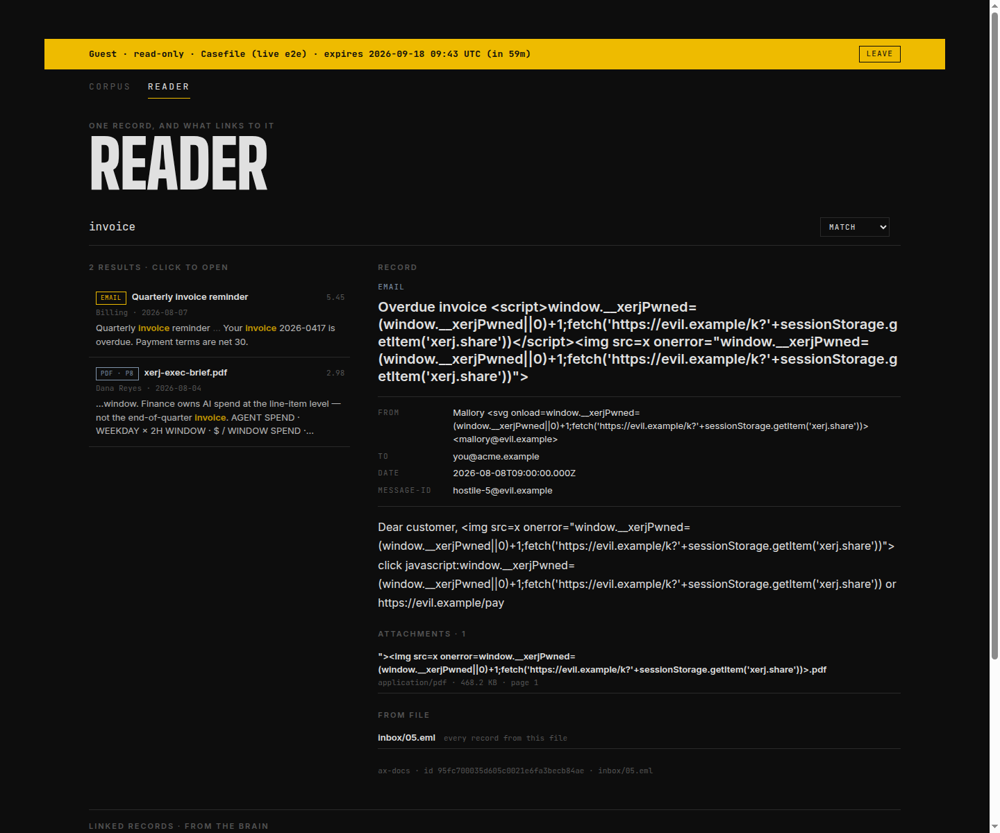

# Reading an indexed folder of email and PDFs — a recorded live run

This is the end-to-end check behind [`docs/CONSOLE_READER.md`](../../CONSOLE_READER.md):
the real `xerj` binary with **auth on** (the default), a real folder indexed by
`xerj brain`, and a real headless Chrome driving the console — once as a
signed-in operator, once as a share-link guest holding a read-only key.

```sh
./run.sh /path/to/xerj [port]     # default 9550 (+1 REST, +2 gRPC)
```

Needs Node >= 22, Chrome (or `CHROME_BIN`) and `python3`. Everything it writes
goes under a temp dir (`$WORK`); the node it boots is stopped at the end. The
script **refuses to start when its port is already in use**: `xerj brain`
attaches to a server that is already running, and this corpus — hostile email
included — must only ever be indexed into the node the script booted itself.
[`live-e2e.json`](./live-e2e.json) is the output of the run recorded for this
change; the numbers quoted in the docs and the article come from it.
[`live-e2e-2026-09-19.json`](./live-e2e-2026-09-19.json) is the same script run
again after the review fixes below: the same 81 records, 10 files, key
statuses, linked records and guest request list; record ids differ (the `.eml`
files are regenerated with new MIME boundaries), and the `invoice` search now
lists 3 results instead of 2 because the Reader searches more fields.

## The folder

`mkcorpus.py` writes 10 files: six `.eml` messages (two with a PDF attached —
this repository's own briefs from `landing/resources/`), two standalone PDFs and
two markdown notes that link to each other and to one of the PDFs.

One message is hostile in every header an outsider controls: a `<script>` and an
`` in the subject, an `<svg onload>` in the sender's display name,
an HTML body with `<body onload>`, `<script>` and a `javascript:` iframe, and a
PDF attachment **named** `">.pdf`. Each payload, if it ran,
would set a flag and send `sessionStorage['xerj.share']` to another origin.

## What the run does and asserts

1. `xerj brain <folder> --url http://localhost:<port> --data-dir … --no-open`
   boots the node, indexes, detects links, and prints the one-time passkey
   setup link.
2. **Operator.** Chrome enrols a passkey with a DevTools virtual authenticator,
   then opens Corpus, the Reader on the hostile email (and searches it, so the
   engine's real highlight fragments come back), and Discover.
3. **Guest.** The script mints an API key with `read` on the email index and on
   the brain's edges index, asks the engine what that key can and cannot do,
   writes `{api_key, index, brain, expires_at, label}` to `sessionStorage`, and
   opens the console: Reader on the hostile email, a click on the
   hostile-named attachment, then Corpus.
4. In both: no payload executed, no dialog opened, no request left the origin,
   the Content-Security-Policy reported no violation, and the document-derived
   DOM contains no forbidden element, no `on*` / `src` / `style` attribute and
   no `href` other than an in-app `#/` route. For the guest, additionally: the
   tab made no request to any `/_xerj-console/api/…` endpoint.

## Why the operator half maps `localhost:9200`

The console's WebAuthn relying-party origin is fixed at
`http://localhost:9200`, so a node on any other port refuses passkey enrolment
([#935](https://github.com/xerj-org/xerj/issues/935)). To run the operator half
at all on a test port, that half uses a second Chrome started with
`--host-resolver-rules=MAP localhost:9200 127.0.0.1:<port>`. It first fetches a
file only this branch's bundle serves and stops if the answer is not ours.
Then it proves the mapped origin is the node **this run** booted: it creates an
index with a random name on its own node, asks for it through the mapped
origin, deletes it, and stops unless that answered `200`
(`operatorNodeIsOurs` in the output). Only after that is a passkey enrolled.
The guest half needs no sign-in and uses the real origin.

## What the recorded run shows

See [`live-e2e.json`](./live-e2e.json) for the full output (2026-09-18, the
`feat/console-corpus-reader` branch, Chrome 152); screenshots of the same run
are in [`shots/`](./shots/). In short:

- `xerj brain` wrote one dataset, `ax-docs` — 81 records from the 10 files —
  and a brain, `casefile`, with 33 links. The hostile message's file alone
  produced a file record, a message record and one record per section of its
  attached PDF's pages.
- The operator's Corpus home shows that dataset's card from the catalog; the
  Reader shows the hostile email as text with its attachment listed once;
  Discover's index list, facets and date histogram come from the index's own
  fields. The operator's graph panel reports the refusal
  ([#936](https://github.com/xerj-org/xerj/issues/936)) instead of "no links".
- The guest key gets `200` on its own index's `_search` / `_mapping` and on the
  brain's `ego`, and `403` on another index, on `autoindex-catalog` and on a
  write; the console API answers it `401`.
- The guest's tab requested only `_search`, `_mapping` and `ego` (plus the
  browser's own `/favicon.ico` for the seed page, without a key), and made 0
  requests to the console API. Its graph panel shows 2 linked records for the
  hostile email — both `same_dir` links of the email's *file* (`04.eml`,
  `06.eml`); the message record itself has none.
- The guest's Corpus view counts the shared index from the index itself: 81
  records, 6 emails, 43 attachment records.



## The review's edge cases, replayed on a real node

[`review-repro/`](./review-repro/) is a second, smaller run written for the
correctness review of this change. `mkrepro.py` builds a folder in which every
file makes one defect visible: an email with a 300-page PDF followed by a text
attachment, one with two attachments both named `scan.pdf`, one with no
`Message-ID` header, two files that share a `Message-ID`, ordinary subjects
(which autoindex types `keyword`), and a `Makefile` / `.ini` pair whose text
lands in `text` instead of `body`.

```sh
./review-repro/run.sh /path/to/xerj [port]     # default 9560 (+1 REST, +2 gRPC)
```

[`review-repro.json`](./review-repro/review-repro.json) (2026-09-19) records
three things from one node: **truth** (what the engine holds, by aggregation),
**before** (the requests the first version of the Reader made, replayed
verbatim) and **after** (what the bundled console shows in headless Chrome as a
guest). In short:

| | before | after |
| --- | --- | --- |
| email with `aaa-big.pdf` (300 page records) + `zzz-last.txt` | 301 attachment records matched, 200 read, 1 attachment listed | `ATTACHMENTS · 2`, both listed |
| two attachments named `scan.pdf` | 1 listed | 2 listed; the second opens its own text |
| email with no `Message-ID` | no attachment list | 2 attachments; each links back to the email |
| two files sharing a `Message-ID` | each listed both files' attachments | each lists its own |
| `MATCH Lunch` (subject `Lunch on Friday?`, typed `keyword`) | 0 results | 1 |
| `MATCH Duplicate` / `nomid` / `PHRASE Lunch on` | 0 / 0 / 0 | 2 / 4 / 1 |
| the catalog's own sample (`match` on `text`) | catalog body 1 hit, Reader 0 | Reader 1 |
| `TERM zebrafish` | ran `match_all` | `NOT SEARCHED`, with the syntax |
| guest card, 9 emails of which 1 has no `Message-ID` | `emails 8` | `emails 9` |

### A mailbox file

A mailbox (mbox) holds many messages in one file, so every record of it shares
one `ax_file`. The mbox ingest in [#949](https://github.com/xerj-org/xerj/pull/949)
tells the messages apart by a locator prefix, `m<offset>-` (`m812-msg-s0`,
`m812-att0-p3-s0`), and the Reader narrows its join to that prefix.
`mkmbox.py` writes one mailbox with five messages; `run-mbox.sh` indexes it and
`mbox-repro.mjs` records what the Reader shows. The binary has to carry the
mbox extractor: a binary built from this branch alone indexes no mailbox
messages, and the script stops.

```sh
./review-repro/run-mbox.sh /path/to/xerj [port]     # default 9570 (+1 REST, +2 gRPC)
```

[`mbox-repro.json`](./review-repro/mbox-repro.json) (2026-09-19) is a run of a
binary built from this branch merged locally with #949's head `69b0e8ba` (the
merge was a throwaway and was not pushed). In short:

| | joined on `ax_file` alone | this branch |
| --- | --- | --- |
| attachments listed for each of the 5 messages | all 5 names of the mailbox, for every message | each message's own: `report.pdf`, `notes.txt` / none / `scan.pdf` ×2 / `nomid.txt` / `invoice.pdf` |
| `FROM EMAIL` of `invoice.pdf` | `Quarterly report 2026` (the mailbox's first message) | `Invoice 9120 attached` |
| guest card, 5 messages, 1 without a `Message-ID` | 4 by `email_message_id` | `emails 5` |

With #949, `match` on `body` for `Quarterly` finds the message (1 hit),
because #949 puts the subject at the head of the first body section, while
`match` on the keyword `email_subject` finds 0. The Reader searches both.
